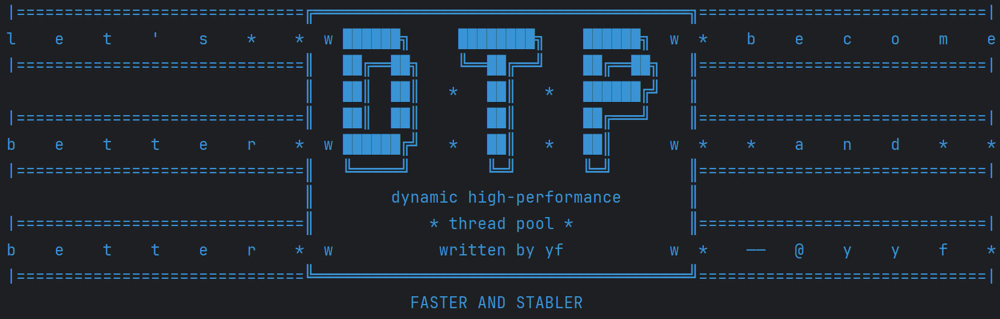
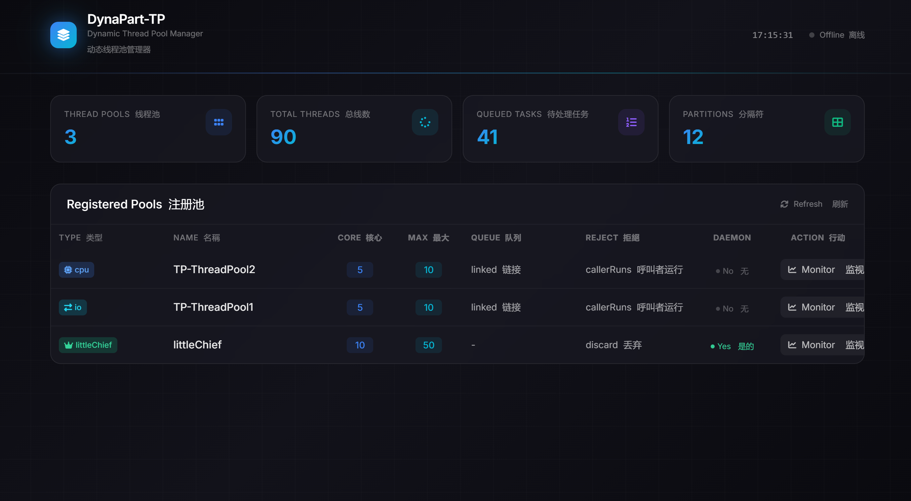
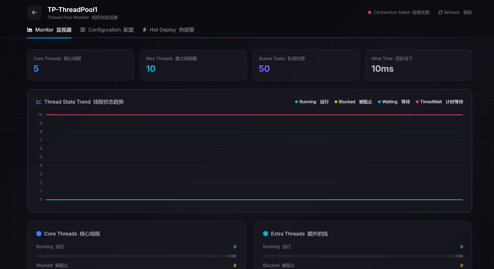
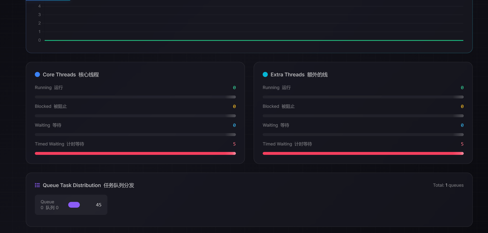
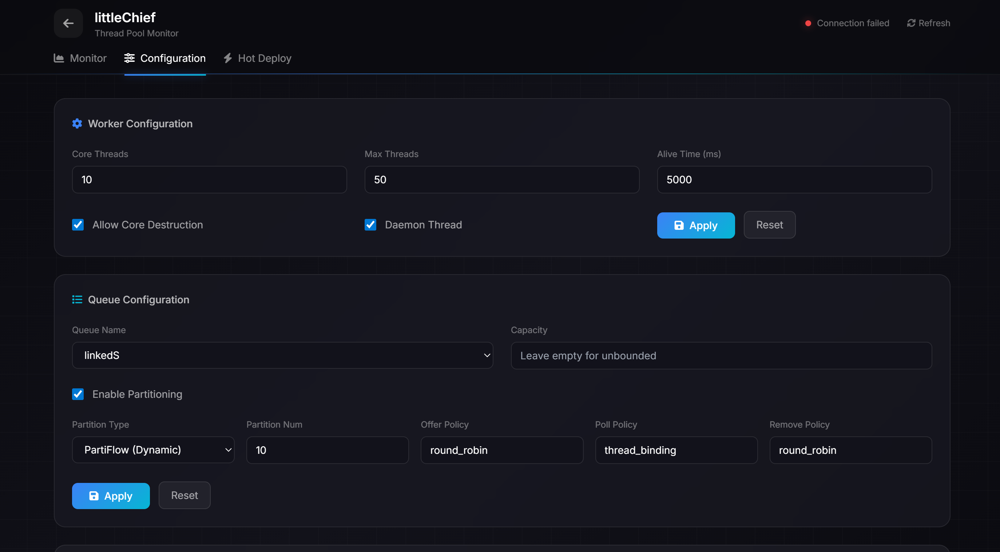
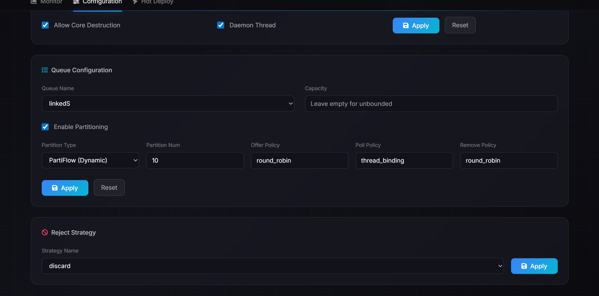
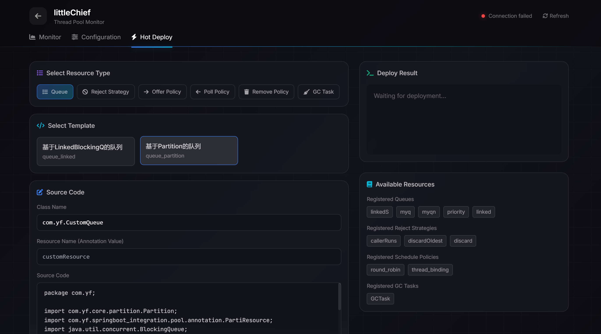
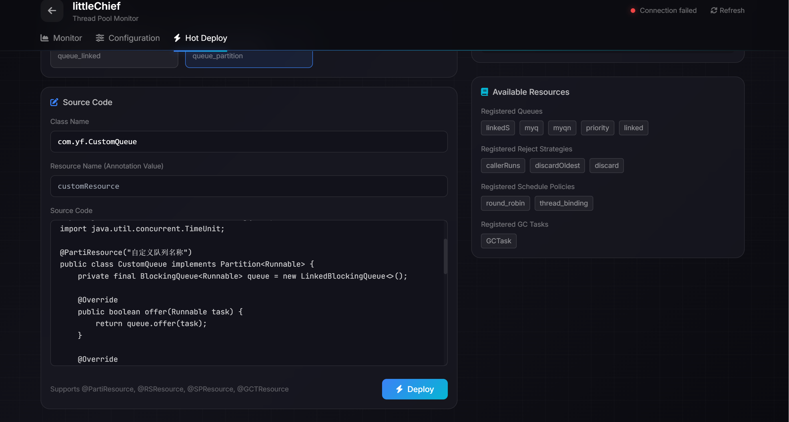

# DynaPart-TP 动态分区线程池




> **English Documentation**: [README.md](README.md)

---

## 一句话概括

DynaPart-TP 是一个通过**分区化队列**降低锁竞争、支持**运行时热切换**的高性能动态线程池框架。

---

## 核心亮点

| 亮点 | 说明 |
|------|------|
| **分区化队列** | 多分区独立锁，显著降低锁竞争 |
| **三维调度策略** | 入队/出队/移除策略独立配置 |
| **三层兜底队列切换** | 切换时旧Worker安全退出、旧队列资源回收 |
| **注解式资源管理** | @ResourceScan自动扫描注册，自定义组件零配置 |
| **运行时热部署** | 动态编译Java代码，不停机更新 |
| **实时监控** | REST API + WebSocket监控面板 |

---

## 整体架构

```
┌─────────────────────────────────────────────────────────────────────────────────────────────┐
│                                         Application                                          │
└─────────────────────────────────────────────────────────────────────────────────────────────┘
                                              │
                    ┌─────────────────────────┬─────────────────────────┐
                    │                         │                         │
                    ▼                         ▼                         ▼
┌─────────────────────────────────┐ ┌───────────────────────────┐ ┌───────────────────────────┐
│           ThreadPool            │ │   UnifiedTPRegulator      │ │    ResourceContainer      │
│                                 │ │                           │ │                           │
│  Worker线程组 ←→ 队列 ←→ 拒绝策略│ │  动态调控器：              │ │  资源管理器：              │
│                                 │ │  注册/切换/监控/调参       │ │  @ResourceScan扫描注册     │
└─────────────────────────────────┘ └───────────────────────────┘ └───────────────────────────┘

                         ┌──────────────────────────────────────────────────────┐
                         │                  ResourceContainer                    │
                         │                                                       │
                         │   ResourceScanner ───→ @ResourceScan 扫描包及子包     │
                         │         │                                           │
                         │         ├── @PartiResource ──→ PartiResourceManager   │
                         │         ├── @SPResource ────→ SPResourceManager       │
                         │         ├── @RSResource ────→ RSResourceManager       │
                         │         └── @GCTResource ───→ GCTaskManager          │
                         └──────────────────────────────────────────────────────┘
```

### 组件职责

| 组件 | 职责 |
|------|------|
| **ThreadPool** | 核心线程池，管理Worker生命周期 |
| **Worker** | 从队列取任务执行 |
| **Partition** | 队列抽象（单一/分区化） |
| **Partitioning** | 分区化队列接口（PartiFlow/PartiStill） |
| **OfferPolicy/PollPolicy/RemovePolicy** | 三维调度策略 |
| **RejectStrategy** | 拒绝策略 |
| **UnifiedTPRegulator** | 全局线程池注册表 + 动态调控 |
| **ResourceScanner** | 注解扫描与资源注册 |
| **GCTaskManager** | 队列切换时的GC清理任务管理 |

---

## 分区化机制（队列+调度策略）

这是DynaPart-TP的**核心机制**，从任务入队到出队的完整链路。

### 问题：传统线程池的锁竞争

传统线程池使用单一队列，所有线程竞争同一把锁：

```
┌─────────────────────────────────────────────────────────────┐
│                    传统单队列线程池                            │
│                                                             │
│   ThreadPool                                                 │
│   ┌───────────────────┐                                     │
│   │    单队列 (一把锁)  │ ←── 所有线程竞争同一把锁              │
│   └───────────────────┘                                     │
│         ↓                                                    │
│   ThreadA ──→ [BLOCKED]                                      │
│   ThreadB ──→ [BLOCKED]                                      │
│   ThreadC ──→ [BLOCKED]                                      │
└─────────────────────────────────────────────────────────────┘
```

**问题**：高并发下，同步开销成为瓶颈。

### 解决：分区化队列 + 三维调度策略

```
┌─────────────────────────────────────────────────────────────────────┐
│                     分区化线程池（完整链路）                             │
│                                                                     │
│  【任务入队链路】                                                      │
│   execute(task)                                                      │
│       ↓                                                              │
│   OfferPolicy.selectPartition()  ──→ "任务该进哪个分区？"              │
│       ↓                                                              │
│   Partition.offer(task)      ──→ 任务进入对应分区的子队列              │
│                                                                     │
│  【Worker取任务链路】                                                 │
│   Worker.run()                                                       │
│       ↓                                                              │
│   PollPolicy.selectPartition()  ──→ "从哪个分区取？"                  │
│       ↓                                                              │
│   Partition.poll()              ──→ 从对应分区取出任务                 │
│                                                                     │
│  【任务拒绝链路】                                                      │
│   队列满/线程池满                                                      │
│       ↓                                                              │
│   RemovePolicy.selectPartition()  ──→ "从哪个分区丢弃？"              │
│       ↓                                                              │
│   Partition.removeEle()         ──→ 从对应分区移除任务                 │
└─────────────────────────────────────────────────────────────────────┘
```

### 队列实现

#### 单一队列：LinkedBlockingQ（双锁分离）

生产者和消费者使用**独立锁**，互不阻塞：

```java
public class LinkedBlockingQ<T> extends Partition<T> {
    private final Lock headLock = new ReentrantLock();  // 消费者锁
    private final Lock tailLock = new ReentrantLock();  // 生产者锁
    private final Condition notEmpty = headLock.newCondition();
}
```

#### 分区化队列：PartiFlow（动态分区）

```
┌────────────────────────────────────────────────────────────────┐
│                        PartiFlow                                 │
│                     (分区化队列，实现Partitioning接口)             │
│                                                                 │
│  ┌──────────────────────────────────────────────────────────┐   │
│  │                    调度策略层                              │   │
│  │   ┌────────────┐  ┌────────────┐  ┌────────────┐        │   │
│  │   │ OfferPolicy│  │ PollPolicy │  │RemovePolicy│        │   │
│  │   │  入队策略  │  │  出队策略  │  │  移除策略  │        │   │
│  │   └─────┬──────┘  └─────┬──────┘  └─────┬──────┘        │   │
│  └─────────┼───────────────┼───────────────┼────────────────┘   │
│            └───────────────┼───────────────┘                    │
│                            ▼                                    │
│  ┌──────────────────────────────────────────────────────────┐   │
│  │                      分区层                                │   │
│  │   ┌────────┐  ┌────────┐  ┌────────┐  ┌────────┐         │   │
│  │   │ 分区0   │  │ 分区1   │  │ 分区2   │  │ 分区3   │  ... │   │
│  │   │(子队列) │  │(子队列) │  │(子队列) │  │(子队列) │       │   │
│  │   └────────┘  └────────┘  └────────┘  └────────┘         │   │
│  │                                                          │   │
│  │   每个分区独立锁：Lock0 / Lock1 / Lock2 / Lock3          │   │
│  └──────────────────────────────────────────────────────────┘   │
└────────────────────────────────────────────────────────────────┘
```

**两种分区化队列**：

| 类型 | 类名 | 特点 |
|------|------|------|
| 动态分区 | `PartiFlow` | 调度后轮询：分区满则尝试下一个分区，更灵活 |
| 静态分区 | `PartiStill` | 直接路由：分区满则返回false，更高性能 |

### 内置调度策略

#### 入队策略（OfferPolicy）

| 配置值 | 原理 | 特点 |
|--------|------|------|
| `round_robin` | 原子计数轮询 | 负载均衡 |
| `random` | 随机选择 | 实现简单 |
| `plain_hash` | 按hashCode选择 | 同任务同分区 |
| `balanced_hash` | hash扰动优化 | 分布均匀 |
| `valley_filling` | 选择任务最少的分区 | 动态均衡 |
| `priority` | Priority任务按priority值选择分区；非Priority任务降级为轮询 | **可降级优先级** |

#### 出队策略（PollPolicy）

| 配置值 | 原理 | 特点 |
|--------|------|------|
| `round_robin` | 原子计数轮询 | 公平 |
| `random` | 随机选择 | 去中心化 |
| `thread_binding` | ThreadLocal绑定线程 | **高缓存命中** |
| `peek_shaving` | 从最忙分区取 | 削峰 |
| `priority` | 优先选择有任务的分区（低索引），全空时降级为轮询 | **可降级优先级** |

#### 移除策略（RemovePolicy）

| 配置值 | 原理 |
|--------|------|
| `round_robin` | 轮询 |
| `random` | 随机 |
| `peek_shaving` | 从最忙分区移除 |
| `priority` | 从高索引分区开始移除，保留低索引分区（高优先级），全空时返回最后一个分区 |

### 特色调度策略（可选深入）

以下策略具有特色实现，开发者可根据场景选用：

**1. 线程绑定（thread_binding）**
- 通过ThreadLocal让每个线程固定绑定某个分区
- 优势：高缓存命中率，适合长时任务
- 注意：必须配合GCTask机制（队列切换时清理旧Worker）

**2. 均衡哈希（balanced_hash）**
- hash扰动优化，分布更均匀
- 比plain_hash更均匀，但计算稍复杂

**3. 优先级策略（priority）**
- 入队：Priority任务按`getPriority()`返回值选择分区；非Priority任务降级为轮询
- 出队：优先选择有任务的分区（低索引优先），所有分区都空时降级为轮询
- 移除：从高索引分区开始移除（优先腾出低优先级分区），所有分区都空时返回最后一个分区

### 调度后轮询（roundRobin属性）

每个策略有`roundRobin`属性：
- `false`：策略选哪个分区就只操作哪个
- `true`：策略选的分区失败，自动尝试下一个

```
例：valley_filling + roundRobin=true
策略选分区0，但分区0满了 → 自动尝试分区1，成功
```

**注意**：`thread_binding`必须`roundRobin=false`，否则一个线程操作多分区破坏缓存局部性。

---

## 队列切换机制（三层兜底 + GCTask）

### 问题：动态切换队列时面临的挑战

切换队列时需要解决两个问题：
1. **旧Worker感知切换并退出**：不能再从旧队列取任务
2. **旧队列资源回收**：旧队列应能被GC

### 解决：三层兜底机制 + GCTask

```
┌─────────────────────────────────────────────────────────────────────────────────┐
│                        队列切换完整链路                                          │
│                                                                                 │
│  调用 UnifiedTPRegulator.changeQueue("poolName", newQueue)                        │
│                                                                                 │
│  ┌───────────────────────────────────────────────────────────────────────────┐  │
│  │ 第一层：同步标记（旧队列已切换）                                              │  │
│  │         oldQ.markAsSwitched()  →  所有分区 switched=true                  │  │
│  │         → 新任务offer时检测到，直接抛SwitchedException                    │  │
│  └───────────────────────────────────────────────────────────────────────────┘  │
│                                    │                                            │
│                                    ▼                                            │
│  ┌───────────────────────────────────────────────────────────────────────────┐  │
│  │ 第二层：锁后检查（旧Worker退出）                                             │  │
│  │         旧Worker在poll()时：                                               │  │
│  │         1. 先获取锁（lockGlobally）                                        │  │
│  │         2. 检查switched标志                                                 │  │
│  │         3. 若为true，抛SwitchedException，Worker退出                        │  │
│  └───────────────────────────────────────────────────────────────────────────┘  │
│                                    │                                            │
│                                    ▼                                            │
│  ┌───────────────────────────────────────────────────────────────────────────┐  │
│  │ 第三层：GCTask兜底（旧队列GC）                                               │  │
│  │         边缘情况（ThreadLocal绑定、无锁队列）无法被前两层处理时：                 │  │
│  │         → GCTaskManager.clean() 执行兜底清理                                 │  │
│  │         → 销毁持有旧引用的Worker → 新Worker新绑定 → 旧队列可GC                │  │
│  └───────────────────────────────────────────────────────────────────────────┘  │
│                                                                                 │
│  ┌───────────────────────────────────────────────────────────────────────────┐  │
│  │ 异步迁移：GCTaskManager.execute() 迁移旧队列剩余任务到新队列                   │  │
│  └───────────────────────────────────────────────────────────────────────────┘  │
└─────────────────────────────────────────────────────────────────────────────────┘
```

### GCTask机制

**为什么需要GCTask？**

当使用`thread_binding`出队策略时，Worker通过ThreadLocal绑定**分区索引**：
- 首次选择分区时，`threadLocal.set(index)` 存储分区索引
- 之后每次poll都返回同一个索引的分区

**问题**：ThreadLocal的key是**弱引用**（会被GC回收），但value（Integer索引）是**强引用**（不会被回收）

```
GC前：ThreadLocalMap: { ThreadLocal(key) → Integer(index=value) }
                    key是弱引用，会被GC回收
GC后：ThreadLocalMap: { null → Integer }  ← Integer对象无法被GC（内存泄漏）
```

随着队列切换次数增加，越来越多的Integer对象无法被回收，造成**内存泄漏**。

**GCTask解决方案**：销毁旧Worker → 旧Worker的ThreadLocal随Worker销毁而销毁 → 无泄漏

### GCTaskManager架构

```java
public class GCTaskManager {
    // 专用异步线程池（执行GCTask，不能阻塞主切换流程）
    private static volatile ThreadPool littleChief;

    // 调度策略 → GCTask 的映射
    private static Map<Class<? extends SchedulePolicy>,
                      Class<? extends GCTask>> SCHEDULE_TASK_MAP = new HashMap<>();

    // 分区类型 → GCTask 的映射
    private static Map<Class<? extends Partition<?>>,
                      Class<? extends GCTask>> PARTI_TASK_MAP = new HashMap<>();

    static {
        // ThreadBindingPoll使用ThreadLocal，需要清理
        register(ThreadBindingPoll.class, TBPollCleaningTask.class);
    }
}
```

### littleChief线程池

**是什么**：littleChief是GCTaskManager内部专用于执行GCTask的线程池，负责异步执行队列切换时的清理任务。

**为什么是单例**：
- GCTask只是清理任务，执行时间短，不需要每次切换都创建新线程池
- 一个小型线程池足以应对所有GCTask的清理任务
- 避免多次切换时线程池积累造成资源浪费
- 便于统一管理和监控

**三种配置方式**：

#### 1. 不配置（使用默认实现）

如果不配置，littleChief使用**懒汉单例**默认实现，首次调用`GCTaskManager.execute()`时自动创建：

```java
// 默认配置
ThreadPool littleChief = new ThreadPool(
    "littleChief",           // 名称
    5,                       // 核心线程数
    10,                      // 最大线程数
    "littleChief",           // 线程名前缀
    new WorkerFactory("", false, true, 10),  // 非守护，核心可销毁
    new LinkedBlockingQ<>(50),   // 队列容量50
    new CallerRunsStrategy()     // 拒绝策略
);
```

#### 2. yml配置（Spring Boot自动配置）

在`application.yml`中配置littleChief参数，Spring Boot会自动创建并注入：

```yaml
yf:
  thread-pool:
    little-chief:  # GC异步任务的专用线程池
      enabled: true
      useVirtualThread: false  # 是否使用虚拟线程
      coreNums: 10              # 核心线程数
      maxNums: 50              # 最大线程数
      threadName: yf-thread    # 线程名称
      useDaemon: true          # 是否守护线程
      aliveTime: 5000          # 空闲存活时间(ms)
      rejectStrategyName: discard  # 拒绝策略
```

#### 3. 手动配置

通过`GCTaskManager.setLittleChief(ThreadPool tp)`手动设置：

```java
// 创建自定义littleChief线程池
ThreadPool myLittleChief = new ThreadPool(
    "my-gc-pool", 5, 10, "gc-worker",
    new WorkerFactory("gc", false, true, 5000),
    new LinkedBlockingQ<>(100),
    new CallerRunsStrategy()
);

// 手动注入（推荐在应用启动时尽早设置）
GCTaskManager.setLittleChief(myLittleChief);
```

**注意**：`setLittleChief()`只能设置一次，后续调用无效。

### GCTask相关注解

| 注解 | 作用 | 注册到 |
|------|------|--------|
| `@GCTResource` | 绑定自定义GCTask到特定策略/队列 | GCTaskManager |

**@GCTResource注解参数**：

| 参数 | 类型 | 说明 |
|------|------|------|
| `bindingPartiResource` | String | 绑定的队列资源名称（对应@PartiResource的name） |
| `bindingSPResource` | String | 绑定的调度策略名称（对应@SPResource的name） |
| `spType` | String | 策略类型：`poll:`（出队）、`offer:`（入队）、`remove:`（移除） |

**示例**：

```java
// 自定义GCTask，绑定到名为"myPoll"的出队策略
@GCTResource(bindingSPResource = "myPoll", spType = "poll:")
public class MyGCTask extends GCTask {
    @Override
    public void run() {
        // 自定义清理逻辑
    }
}
```

### 内置GCTask：TBPollCleaningTask

当切换使用`thread_binding`策略的队列时，自动执行此清理任务：

```java
public class TBPollCleaningTask extends GCTask {
    @Override
    public void run() {
        // 销毁所有Worker，新Worker将基于新队列创建
        UnifiedTPRegulator.destroyWorkers(
            threadPool.getName(),
            coreList.size(),
            extraList.size()
        );
    }
}
```

---

## 资源扫描与容器化管理

### 核心注解

| 注解 | 作用 | 注册到 |
|------|------|--------|
| `@ResourceScan` | 启用包扫描（扫描入口类所在包及子包） | - |
| `@PartiResource("name")` | 自定义队列 | PartiResourceManager |
| `@SPResource("name")` | 自定义调度策略 | SPResourceManager |
| `@RSResource("name")` | 自定义拒绝策略 | RSResourceManager |
| `@GCTResource(...)` | 自定义GCTask | GCTaskManager |

### 扫描流程

```
应用启动
    │
    ▼
发现 @ResourceScan 注解的入口类
    │
    ▼
ResourceScanner.scan(入口类)
    │
    ├── 扫描入口类所在包及子包所有.class文件
    │
    ├── 找到 @PartiResource ──→ PartiResourceManager.register(name, class)
    ├── 找到 @SPResource ────→ SPResourceManager.register(name, class)
    ├── 找到 @RSResource ────→ RSResourceManager.register(name, class)
    └── 找到 @GCTResource ───→ GCTaskManager.register(binding, class)
```

### 使用示例

```java
@ResourceScan  // 启用扫描
public class MyApplication {
    public static void main(String[] args) {
        // 扫描自动完成
    }
}

// 自定义队列
@PartiResource("myQueue")
public class MyQueue extends LinkedBlockingQ<Runnable> { ... }

// 自定义出队策略
@SPResource("myPoll")
public class MyPoll extends PollPolicy { ... }

// 自定义GCTask
@GCTResource(bindingSPResource = "myPoll", spType = "poll:")
public class MyGCTask extends GCTask { ... }
```

---

## 热部署机制（胶水模式）

运行时将Java代码字符串动态编译为Class文件。

### REST API

```
POST /monitor/hotDeploy?className=com.example.MyTask
Body: Java代码字符串
```

编译后的类会自动检测注解并注册到对应资源管理器。

### 代码调用

```java
DynamicCompiler compiler = new DynamicCompiler();
Class<?> clazz = compiler.compileToClass("com.example.MyTask", javaCodeString);
Runnable task = (Runnable) clazz.getDeclaredConstructor().newInstance();
```

---

## 快速开始

### Spring Boot集成（推荐）

**1. 入口类添加@ResourceScan**
```java
@ResourceScan
public class MyApplication {
    public static void main(String[] args) {
        SpringApplication.run(MyApplication.class, args);
    }
}
```

**2. 配置application.yml**
```yaml
yf:
  thread-pool:
    little-chief:  # 配置littleChief线程池本身
      enabled: true
      coreNums: 10
      maxNums: 50
      threadName: worker
      useDaemon: false
      aliveTime: 60000
      rejectStrategyName: callerRuns
    queue:  # 配置littleChief内部使用的队列
      partitioning: true
      partitionNum: 8
      capacity: 10000
      queueName: linked
      offerPolicy: valley_filling
      pollPolicy: round_robin
      removePolicy: round_robin
    monitor:
      enabled: true
      fixedDelay: 1000
```

**3. 使用**
```java
@Autowired
private ThreadPool threadPool;

threadPool.execute(() -> System.out.println("任务执行"));
```

### 独立使用（无Spring）

```java
// 1. 手动调用资源扫描（如果有自定义资源需要注册）
ResourceScanner.scan(YourApplication.class);

// 2. 创建分区队列
Partition<Runnable> queue = new PartiFlow<>(
    8, 10000, "linked",
    new ValleyFillingOffer(),
    new ThreadBindingPoll(),
    new RoundRobinRemove()
);

// 3. 创建线程池
ThreadPool threadPool = new ThreadPool(
    10, 50, "my-pool",
    new WorkerFactory("worker", false, false, 60000),
    queue,
    new CallerRunsStrategy()
);

// 4. 注册
UnifiedTPRegulator.register("my-pool", threadPool);

// 5. 使用
threadPool.execute(() -> {});
```

**注意**：如果没有使用@ResourceScan注解或自定义资源，需要手动调用`ResourceScanner.scan(入口类)`进行资源扫描注册。

### 热切换示例

```java
// 动态调整线程参数
UnifiedTPRegulator.changeWorkerParams("poolName", 20, 100, null, null, null);

// 动态切换队列
Partition<Runnable> newQueue = new LinkedBlockingQ<>(20000);
UnifiedTPRegulator.changeQueue("poolName", newQueue);

// 动态切换拒绝策略
UnifiedTPRegulator.changeRejectStrategy("poolName", new AbortStrategy(), "abort");
```

---

## 配置参数

### little-chief（GC异步任务线程池）

`little-chief`配置节点用于配置**littleChief线程池本身**，它是GCTaskManager内部专用于执行GCTask的线程池。

| 参数 | 类型 | 说明 | 默认值 |
|------|------|------|--------|
| enabled | boolean | 是否启用 | true |
| useVirtualThread | boolean | 是否使用虚拟线程 | false |
| coreNums | int | 核心线程数 | 5 |
| maxNums | int | 最大线程数 | 10 |
| threadName | String | 线程名称 | littleChief |
| useDaemon | boolean | 是否守护线程 | false |
| aliveTime | long | 空闲存活时间(ms) | 10000 |
| rejectStrategyName | String | 拒绝策略 | callerRuns |

### queue（littleChief内部队列）

`queue`配置节点用于配置**littleChief线程池内部使用的队列**。

| 参数 | 类型 | 说明 | 默认值 |
|------|------|------|--------|
| partitioning | boolean | 是否分区化 | false |
| partitionNum | int | 分区数量（建议2的次幂） | 4 |
| capacity | Integer | 容量，null=无界 | - |
| queueName | String | 队列类型 | linked |
| offerPolicy | String | 入队策略 | round_robin |
| pollPolicy | String | 出队策略 | round_robin |
| removePolicy | String | 移除策略 | round_robin |

**队列类型（queueName）**：

| 值 | 类名 | 特点 |
|----|------|------|
| linked | LinkedBlockingQ | 双锁分离，有界/无界 |
| linkedS | LinkedBlockingQS | CAS优化版本 |
| priority | PriorityBlockingQ | 优先级队列 |

**队列类型（queueName）**：

| 值 | 类名 | 特点 |
|----|------|------|
| linked | LinkedBlockingQ | 双锁分离，有界/无界 |
| linkedS | LinkedBlockingQS | CAS优化版本 |
| priority | PriorityBlockingQ | 优先级队列 |

---

## REST API

| 方法 | 路径 | 说明 |
|------|------|------|
| GET | `/monitor/pool?tpName=xxx` | 线程池信息 |
| GET | `/monitor/tasks?tpName=xxx` | 任务数量 |
| GET | `/monitor/partitionTaskNums?tpName=xxx` | 各分区任务数 |
| GET | `/monitor/threadInfo?tpName=xxx` | 线程状态 |
| PUT | `/monitor/worker?tpName=xxx` | 调整线程参数 |
| PUT | `/monitor/queue?tpName=xxx` | 切换队列 |
| PUT | `/monitor/rejectStrategy?tpName=xxx&rsName=xxx` | 切换拒绝策略 |
| POST | `/monitor/hotDeploy?className=xxx` | 热部署 |

---

## Web界面截图

### 首页监控面板



### 分区状态监控




### 动态配置界面




### 热部署界面




---

## 项目结构

```
src/main/java/com/yf/
├── common/                    # 公共组件
│   ├── constant/              # 常量定义
│   ├── entity/                # 实体类（PoolInfo、QueueInfo）
│   ├── exception/             # 异常类（SwitchedException）
│   ├── glue/                  # 动态编译（胶水模式）
│   │   ├── DynamicCompiler.java
│   │   ├── MemoryClassLoader.java
│   │   ├── MemoryFileManager.java
│   │   └── SourceFile.java / ByteCodeFile.java
│   └── task/                  # 任务类
│       ├── GCTask.java        # GC清理任务基类
│       └── impl/
│           └── TBPollCleaningTask.java  # ThreadBinding清理任务
│
├── core/                      # 核心组件
│   ├── partition/             # 队列抽象与实现
│   │   ├── Partition.java    # 抽象基类
│   │   └── Impl/
│   │       ├── LinkedBlockingQ.java   # 双锁单队列
│   │       ├── LinkedBlockingQS.java  # CAS优化单队列
│   │       └── PriorityBlockingQ.java  # 优先级队列
│   │
│   ├── partitioning/          # 分区化队列
│   │   ├── Partitioning.java  # 分区化接口
│   │   ├── impl/
│   │   │   ├── PartiFlow.java     # 动态分区
│   │   │   └── PartiStill.java    # 静态分区
│   │   └── schedule_policy/
│   │       ├── OfferPolicy.java   # 入队策略接口
│   │       ├── PollPolicy.java    # 出队策略接口
│   │       ├── RemovePolicy.java  # 移除策略接口
│   │       └── impl/
│   │           ├── offer/          # 入队策略实现
│   │           ├── poll/           # 出队策略实现
│   │           └── remove/         # 移除策略实现
│   │
│   ├── rejectstrategy/        # 拒绝策略
│   │   ├── RejectStrategy.java
│   │   └── impl/
│   │       ├── CallerRunsStrategy.java
│   │       ├── AbortStrategy.java
│   │       ├── DiscardStrategy.java
│   │       └── DiscardOldestStrategy.java
│   │
│   ├── resource_container/    # 资源容器
│   │   ├── ResourceScanner.java   # 扫描器
│   │   ├── scanned_annotation/    # 注解定义
│   │   │   ├── ResourceScan.java
│   │   │   ├── PartiResource.java
│   │   │   ├── SPResource.java
│   │   │   ├── RSResource.java
│   │   │   └── GCTResource.java
│   │   └── resource_manager/       # 资源管理器
│   │       ├── GCTaskManager.java
│   │       ├── PartiResourceManager.java
│   │       ├── SPResourceManager.java
│   │       └── RSResourceManager.java
│   │
│   ├── threadpool/           # 线程池核心
│   │   └── ThreadPool.java
│   ├── tp_regulator/         # 动态调控器
│   │   └── UnifiedTPRegulator.java
│   ├── worker/               # Worker线程
│   │   └── Worker.java
│   └── workerfactory/        # 线程工厂
│       └── WorkerFactory.java
│
└── springboot_integration/    # Spring Boot集成
    ├── monitor/               # 监控模块
    │   ├── auto_configuration/
    │   ├── controller/
    │   │   └── MonitorController.java  # REST API
    │   └── ws/
    │       ├── ThreadPoolWebSocketHandler.java
    │       └── SchedulePushInfoService.java
    └── pool/                 # 自动配置
        └── auto_configuration/
            ├── LittleChiefAutoConfiguration.java
            └── ResourceAutoConfiguration.java
```

---

## FAQ

### 分区数量如何选择？

**建议为2的次幂**（8/16/32/64），可使用位运算替代取模：

```java
// 分区数为2的次幂时
return r & (ps - 1);  // 位运算，单周期

// 非2的次幂时
return r % ps;       // 除法，数十周期
```

### 什么场景下分区化优势明显？

- 高并发、任务量大
- 锁竞争成为瓶颈
- 需要高缓存命中（使用thread_binding策略）

### 调度策略如何选择？

| 场景 | 入队策略 | 出队策略 |
|------|----------|----------|
| 高并发短任务 | valley_filling | round_robin |
| 长时任务（需缓存） | plain_hash | thread_binding |
| 削峰填谷 | valley_filling | peek_shaving |

---

## License

MIT
